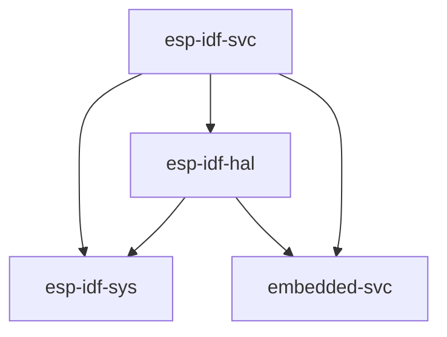

# 使用标准库 (`std`)

乐鑫提供了一个基于 C 的开发框架，称为 [esp-idf][esp-idf-github]，它已经或将支持从 ESP32 开始的所有乐鑫芯片；请注意，此框架_不支持_ ESP8266。另请参阅对 [乐鑫产品的支持][rust-esp-book-overview-index]。

[rust-esp-book-overview-index]: index.md#support-for-espressif-products

反过来，`esp-idf` 提供了一个[新的 lib 环境][newlib-env]，它具有足够的功能来在其上构建 Rust 标准库 (`std`)。这是在 ESP 设备上启用 `std` 支持所采用的方法。

[esp-idf-github]: https://github.com/espressif/esp-idf
[newlib-env]: https://sourceware.org/newlib/

## 当前支持

截至目前，[esp-idf 框架][esp-idf-release-compatibility]支持的乐鑫产品是支持 Rust `std` 开发的产品。

[esp-idf-release-compatibility]: https://github.com/espressif/esp-idf#esp-idf-release-and-soc-compatibility/

使用 `std` 时，您可以访问 [esp-idf][esp-idf-github] 中存在的许多功能，包括线程、互斥锁和其他同步原语、集合、随机数生成、套接字……

### 相关的 `esp-rs` crates

| 仓库            | 描述                                                                                                   |
| --------------------- | ------------------------------------------------------------------------------------------------------------- |
| [esp-rs/embedded-svc] | 嵌入式服务（`WiFi`、`网络`、`Httpd`、`日志记录`等）的抽象特征                        |
| [esp-rs/esp-idf-svc]  | 使用 `esp-idf` 驱动程序的 [embedded-svc] 的实现。                                                  |
| [esp-rs/esp-idf-hal]  | 使用 `esp-idf` 框架实现 `embedded-hal` 和其他特性。                      |
| [esp-rs/esp-idf-sys]  | Rust 绑定到 esp-idf 开发框架。提供对驱动程序、Wi-Fi 等的原始（`不安全`）访问。 |

上述 crates 具有相互依赖性，这种关系可以在下面看到。

### 当您可能想要使用标准库 (`std`)

- 丰富的功能：如果您的嵌入式系统需要大量功能，如支持网络协议、文件 I/O 或复杂的数据结构，您可能希望使用托管环境方法，因为标准库提供了广泛的功能，可以使用相对快速有效地构建复杂的应用程序
- 可移植性：`std` crate 提供了一组标准化的 API，可以跨不同的平台和架构使用，从而更容易编写可移植和可重用的代码。
- 快速开发：`std` crate 提供了一组丰富的功能，可用于快速高效地构建应用程序，而无需过多担心底层细节。

[embedded-svc]: https://github.com/esp-rs/embedded-svc
[esp-rs/embedded-svc]: https://github.com/esp-rs/embedded-svc
[esp-rs/esp-idf-svc]: https://github.com/esp-rs/esp-idf-svc
[esp-rs/esp-idf-sys]: https://github.com/esp-rs/esp-idf-sys
[esp-rs/esp-idf-hal]: https://github.com/esp-rs/esp-idf-hal

